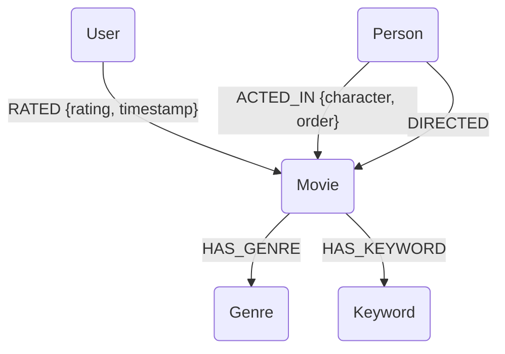

# Updated Database Schema and Graph Model Design for 'The Movies Dataset'

## 1. Introduction

This document outlines the proposed database schema and Apache AGE graph model for integrating 'The Movies Dataset' (Kaggle, by rounakbanik) into the DiskANN and Apache AGE demo. The goal is to leverage the richer metadata available in this dataset, including movie descriptions, cast, and crew, to create a more comprehensive and complex demonstration of vector similarity search and graph analytics.

'The Movies Dataset' is significantly larger and more detailed than the MovieLens 100K dataset, featuring over 45,000 movies and 26 million ratings. It includes several CSV files:

-   `movies_metadata.csv`: Contains core movie information (title, overview, genres, release date, budget, revenue, IMDb ID, TMDB ID, etc.).
-   `credits.csv`: Contains cast and crew information for each movie.
-   `keywords.csv`: Contains plot keywords for each movie.
-   `ratings.csv`: Contains user ratings for movies (similar to MovieLens, but much larger).
-   `links.csv`: Contains IMDb and TMDB IDs for movies.

## 2. Database Schema Design (PostgreSQL)

The new schema will expand upon the previous MovieLens schema, adding tables for actors, directors, and keywords, and enriching the `movies` table with more detailed information. The `users` and `ratings` tables will remain largely similar but will handle a larger volume of data.

### 2.1. Table Definitions

#### `movies` Table

This table will store core movie metadata. The `overview` column will be crucial for generating richer movie embeddings.

| Column Name        | Data Type          | Constraints / Description                                   |
| :----------------- | :----------------- | :---------------------------------------------------------- |
| `movie_id`         | INTEGER            | PRIMARY KEY (TMDB ID)                                       |
| `imdb_id`          | VARCHAR(20)        | UNIQUE (IMDb ID)                                            |
| `title`            | VARCHAR(500)       | NOT NULL                                                    |
| `original_title`   | VARCHAR(500)       |                                                             |
| `overview`         | TEXT               | Movie plot summary/description (for embeddings)             |
| `tagline`          | TEXT               | Short catchy phrase                                         |
| `release_date`     | DATE               |                                                             |
| `budget`           | BIGINT             |                                                             |
| `revenue`          | BIGINT             |                                                             |
| `runtime`          | INTEGER            | Duration in minutes                                         |
| `vote_average`     | NUMERIC(3,1)       | Average vote from TMDB                                      |
| `vote_count`       | INTEGER            | Number of votes                                             |
| `homepage`         | VARCHAR(500)       | Official website URL                                        |
| `status`           | VARCHAR(50)        | e.g., 'Released', 'Rumored'                                 |
| `original_language`| VARCHAR(10)        | ISO 639-1 code                                              |
| `genres`           | JSONB              | Array of genre objects (e.g., `[{"id": 28, "name": "Action"}]`) |
| `production_companies`| JSONB             | Array of production company objects                         |
| `production_countries`| JSONB             | Array of production country objects                         |
| `spoken_languages` | JSONB              | Array of spoken language objects                            |
| `embedding`        | VECTOR(768)        | 768-dimensional embedding vector (for DiskANN)              |
| `created_at`       | TIMESTAMP          | DEFAULT CURRENT_TIMESTAMP                                   |

*Note: The `genres` column will be stored as `JSONB` to preserve the original structure and allow flexible querying. Individual genre flags (like `genre_action` in MovieLens 100K) will not be created, as the `JSONB` column provides more flexibility and avoids schema proliferation for a large number of genres.* The embedding dimension is increased to 768 to accommodate more complex text embeddings from models like `all-MiniLM-L6-v2` or larger BERT-based models, which are better suited for rich text like movie overviews.

#### `users` Table

This table will store user information. The dataset does not provide detailed user demographics beyond `user_id` and `rating`, so we will keep it simple. If a richer user dataset is desired, it would need to be integrated separately.

| Column Name        | Data Type          | Constraints / Description                                   |
| :----------------- | :----------------- | :---------------------------------------------------------- |
| `user_id`          | INTEGER            | PRIMARY KEY (from `ratings.csv`)                            |
| `embedding`        | VECTOR(768)        | 768-dimensional embedding vector (for DiskANN)              |
| `created_at`       | TIMESTAMP          | DEFAULT CURRENT_TIMESTAMP                                   |

*Note: The `embedding` dimension for users is also increased to 768 for consistency and potential future use with more complex user profiling data.* User embeddings will be derived from their rating patterns and potentially aggregated movie embeddings.

#### `ratings` Table

This table will store user ratings for movies. It's a direct import from `ratings.csv`.

| Column Name        | Data Type          | Constraints / Description                                   |
| :----------------- | :----------------- | :---------------------------------------------------------- |
| `user_id`          | INTEGER            | FOREIGN KEY REFERENCES `users(user_id)`                     |
| `movie_id`         | INTEGER            | FOREIGN KEY REFERENCES `movies(movie_id)`                   |
| `rating`           | NUMERIC(2,1)       | NOT NULL (0.5 to 5.0 scale)                                 |
| `timestamp`        | BIGINT             | Unix timestamp of rating                                    |
| `created_at`       | TIMESTAMP          | DEFAULT CURRENT_TIMESTAMP                                   |
| `PRIMARY KEY`      | (user_id, movie_id)| Composite primary key                                       |

#### `persons` Table (for Actors and Directors)

This table will store unique information about actors and directors. We will parse `credits.csv` to populate this table.

| Column Name        | Data Type          | Constraints / Description                                   |
| :----------------- | :----------------- | :---------------------------------------------------------- |
| `person_id`        | INTEGER            | PRIMARY KEY (from TMDB)                                     |
| `name`             | VARCHAR(255)       | NOT NULL                                                    |
| `gender`           | INTEGER            | 0=unknown, 1=female, 2=male                                 |
| `profile_path`     | VARCHAR(255)       | URL path to profile image                                   |
| `known_for_department`| VARCHAR(50)       | e.g., 'Acting', 'Directing', 'Writing'                      |
| `created_at`       | TIMESTAMP          | DEFAULT CURRENT_TIMESTAMP                                   |

#### `movie_cast` Table (Junction Table)

This table links movies to their cast members and stores role-specific information.

| Column Name        | Data Type          | Constraints / Description                                   |
| :----------------- | :----------------- | :---------------------------------------------------------- |
| `movie_id`         | INTEGER            | FOREIGN KEY REFERENCES `movies(movie_id)`                   |
| `person_id`        | INTEGER            | FOREIGN KEY REFERENCES `persons(person_id)`                 |
| `character`        | VARCHAR(500)       | Character name in the movie                                 |
| `credit_id`        | VARCHAR(50)        | Unique credit identifier                                    |
| `cast_id`          | INTEGER            |                                                             |
| `order`            | INTEGER            | Order of appearance in credits                              |
| `PRIMARY KEY`      | (movie_id, person_id, credit_id)| Composite primary key                                       |

#### `movie_crew` Table (Junction Table)

This table links movies to their crew members and stores job-specific information.

| Column Name        | Data Type          | Constraints / Description                                   |
| :----------------- | :----------------- | :---------------------------------------------------------- |
| `movie_id`         | INTEGER            | FOREIGN KEY REFERENCES `movies(movie_id)`                   |
| `person_id`        | INTEGER            | FOREIGN KEY REFERENCES `persons(person_id)`                 |
| `department`       | VARCHAR(100)       | e.g., 'Directing', 'Writing', 'Production'                  |
| `job`              | VARCHAR(100)       | e.g., 'Director', 'Screenplay', 'Producer'                  |
| `credit_id`        | VARCHAR(50)        | Unique credit identifier                                    |
| `PRIMARY KEY`      | (movie_id, person_id, credit_id)| Composite primary key                                       |

#### `keywords` Table

This table stores unique plot keywords.

| Column Name        | Data Type          | Constraints / Description                                   |
| :----------------- | :----------------- | :---------------------------------------------------------- |
| `keyword_id`       | INTEGER            | PRIMARY KEY (from TMDB)                                     |
| `name`             | VARCHAR(255)       | NOT NULL                                                    |
| `created_at`       | TIMESTAMP          | DEFAULT CURRENT_TIMESTAMP                                   |

#### `movie_keywords` Table (Junction Table)

This table links movies to their associated keywords.

| Column Name        | Data Type          | Constraints / Description                                   |
| :----------------- | :----------------- | :---------------------------------------------------------- |
| `movie_id`         | INTEGER            | FOREIGN KEY REFERENCES `movies(movie_id)`                   |
| `keyword_id`       | INTEGER            | FOREIGN KEY REFERENCES `keywords(keyword_id)`               |
| `PRIMARY KEY`      | (movie_id, keyword_id)| Composite primary key                                       |

### 2.2. Indexes

In addition to standard primary key and foreign key indexes, we will create:

-   **DiskANN Vector Indexes**: HNSW indexes on `movies.embedding` and `users.embedding` for efficient similarity search.
    ```sql
    CREATE INDEX idx_movies_embedding_hnsw 
    ON movies USING hnsw (embedding vector_cosine_ops)
    WITH (m = 16, ef_construction = 64);

    CREATE INDEX idx_users_embedding_hnsw 
    ON users USING hnsw (embedding vector_cosine_ops)
    WITH (m = 16, ef_construction = 64);
    ```
-   **JSONB Indexes**: GIN indexes on `movies.genres`, `movies.production_companies`, etc., for efficient querying of JSONB data.
    ```sql
    CREATE INDEX idx_movies_genres_gin ON movies USING GIN (genres);
    -- Add similar indexes for other JSONB columns as needed
    ```
-   **Text Search Indexes**: Potentially `tsvector` indexes on `movies.overview` and `movies.title` for full-text search capabilities.
    ```sql
    ALTER TABLE movies ADD COLUMN tsv_overview TSVECTOR;
    UPDATE movies SET tsv_overview = to_tsvector('english', overview);
    CREATE INDEX idx_movies_tsv_overview ON movies USING GIN (tsv_overview);
    ```

## 3. Apache AGE Graph Model Design

The new dataset allows for a much richer graph model, capturing not just user-movie ratings but also relationships between movies, actors, directors, and keywords. This will enable more complex graph analytics queries.

### 3.1. Node Labels

-   **`User`**: Represents a user who has rated movies.
    -   Properties: `user_id` (INTEGER)
-   **`Movie`**: Represents a movie.
    -   Properties: `movie_id` (INTEGER), `title` (STRING), `overview` (STRING), `release_date` (DATE), `vote_average` (NUMERIC)
-   **`Person`**: Represents an actor or director.
    -   Properties: `person_id` (INTEGER), `name` (STRING), `gender` (INTEGER), `known_for_department` (STRING)
-   **`Genre`**: Represents a movie genre.
    -   Properties: `name` (STRING)
-   **`Keyword`**: Represents a plot keyword.
    -   Properties: `keyword_id` (INTEGER), `name` (STRING)

### 3.2. Relationship Types

-   **`RATED`**: Connects a `User` to a `Movie`.
    -   Properties: `rating` (NUMERIC), `timestamp` (BIGINT)
-   **`ACTED_IN`**: Connects a `Person` (actor) to a `Movie`.
    -   Properties: `character` (STRING), `order` (INTEGER)
-   **`DIRECTED`**: Connects a `Person` (director) to a `Movie`.
    -   No specific properties for this relationship, but can be inferred from `movie_crew`.
-   **`HAS_GENRE`**: Connects a `Movie` to a `Genre`.
    -   No specific properties.
-   **`HAS_KEYWORD`**: Connects a `Movie` to a `Keyword`.
    -   No specific properties.
-   **`PRODUCED_BY`**: Connects a `Movie` to a `ProductionCompany` (if we decide to model companies as nodes).

### 3.3. Graph Structure Example



### 3.4. Graph Creation Strategy

1.  **Create Nodes**: Iterate through the `movies`, `users`, `persons`, `genres` (extracted from `movies_metadata.csv`), and `keywords` tables to create corresponding `Movie`, `User`, `Person`, `Genre`, and `Keyword` nodes.
2.  **Create Relationships**: Iterate through `ratings`, `movie_cast`, `movie_crew`, and `movie_keywords` tables to create `RATED`, `ACTED_IN`, `DIRECTED`, `HAS_GENRE`, and `HAS_KEYWORD` relationships.
    -   For `DIRECTED` relationships, we will filter `movie_crew` entries where `job = 'Director'`.
    -   For `HAS_GENRE` relationships, we will parse the `genres` JSONB column in the `movies` table and create a `Genre` node for each unique genre, then link it to the `Movie` node.

## 4. Embedding Generation Strategy

With the richer dataset, the embedding generation process will be enhanced.

### 4.1. Movie Embeddings (`movies.embedding`)

Movie embeddings will be generated by combining information from `title`, `overview`, and potentially `tagline`, `genres`, and `keywords`. A pre-trained transformer model (e.g., `all-MiniLM-L6-v2` or a larger BERT-based model if resources allow) will be used to generate embeddings from the `overview` and `title` text. Other categorical features (genres, keywords) can be one-hot encoded or embedded and concatenated with the text embedding.

-   **Textual Features**: `overview`, `title`, `tagline`
-   **Categorical Features**: `genres`, `keywords`
-   **Numerical Features**: `vote_average`, `vote_count`, `budget`, `revenue`, `runtime`

The final movie embedding will be a concatenation of these components, normalized to a fixed dimension (e.g., 768).

### 4.2. User Embeddings (`users.embedding`)

User embeddings will be more sophisticated. Instead of just basic demographics, they will incorporate aggregated information from the movies they have rated.

-   **Aggregated Movie Embeddings**: Average or weighted average of embeddings of movies a user has rated highly.
-   **Rating Patterns**: Statistical features derived from their ratings (e.g., average rating, number of ratings, rating distribution).
-   **Genre Preferences**: User's preferred genres based on their highly-rated movies.

The final user embedding will be a concatenation of these features, normalized to a fixed dimension (e.g., 768).

## 5. Demo Query Scenarios (Expanded)

The richer dataset and graph model will enable more complex and insightful demo queries.

### 5.1. DiskANN Queries (Vector Similarity)

-   **Content-Based Movie Recommendation**: Find movies similar to a given movie based on their `overview` and `genre` embeddings.
-   **Personalized User Recommendation**: Recommend movies to a user based on their embedding similarity to other users, or to movies they haven't seen but are similar to movies they liked.
-   **Actor/Director Similarity**: Find actors/directors with similar filmographies based on aggregated movie embeddings.
-   **Keyword-Based Search**: Find movies related to a specific plot keyword or theme.

### 5.2. Apache AGE Queries (Graph Analytics)

-   **Collaborative Filtering (Graph-based)**: Find movies recommended for a user based on the viewing habits of their friends or similar users in the graph.
-   **Actor/Director Collaboration Network**: Analyze the network of actors and directors who have worked together, identifying influential figures or common collaborators.
-   **Movie Franchise/Series Analysis**: Identify movies belonging to the same franchise or series and analyze their connections.
-   **Genre Co-occurrence**: Discover which genres frequently appear together in movies.
-   **Pathfinding**: Find the shortest path between two actors through movies they have acted in, or between two movies through common cast/crew.
-   **Community Detection**: Identify communities of users with similar tastes or groups of movies with shared characteristics.

### 5.3. Hybrid Queries (DiskANN + AGE)

-   **Enhanced Recommendation**: Combine vector similarity (DiskANN) to find similar movies/users with graph traversal (AGE) to refine recommendations based on explicit relationships and implicit connections.
-   **Contextual Search**: Find movies similar to a given movie (DiskANN) and then explore related actors, directors, or genres through the graph (AGE).
-   **Explainable AI**: Use graph paths to explain why a particular movie was recommended (e.g., "Recommended because user X, who liked this movie, also liked movies with actor Y, and this movie features actor Y").

## 6. Conclusion

Adopting 'The Movies Dataset' will significantly enhance the demo's capabilities, allowing for a more realistic and complex showcase of DiskANN and Apache AGE. The proposed schema and graph model provide a robust foundation for integrating rich metadata and performing advanced analytics. The expanded query scenarios will demonstrate the power of combining vector similarity search with graph analytics in a single PostgreSQL environment, offering deeper insights and more sophisticated recommendation systems.

## 7. References

[1] The Movies Dataset. Kaggle. URL: https://www.kaggle.com/datasets/rounakbanik/the-movies-dataset
[2] PostgreSQL Documentation. URL: https://www.postgresql.org/docs/
[3] Apache AGE Documentation. URL: https://age.apache.org/age-manual/master/index.html
[4] DiskANN Documentation. URL: https://github.com/microsoft/DiskANN
[5] Sentence-Transformers Documentation. URL: https://www.sbert.net/

