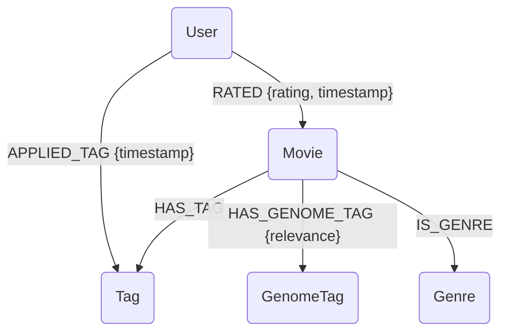

# Updated Database Schema and Graph Model Design for MovieLens 25M Dataset

## 1. Introduction

This document outlines the proposed database schema and Apache AGE graph model for integrating the MovieLens 25M dataset into the DiskANN and Apache AGE demo. The MovieLens 25M dataset offers a significant upgrade in data richness and volume compared to the 100K version, providing a more robust foundation for demonstrating advanced vector similarity search and graph analytics capabilities.

The MovieLens 25M dataset contains 25 million ratings and 1 million tag applications applied to 62,000 movies by 162,000 users. Key files in this dataset include:

-   `ratings.csv`: Contains user ratings for movies.
-   `movies.csv`: Contains movie titles and genres.
-   `tags.csv`: Contains user-applied tags to movies.
-   `links.csv`: Provides external identifiers (IMDb and TMDb IDs) for movies.
-   `genome-scores.csv`: Contains relevance scores between movies and tags from the Tag Genome.
-   `genome-tags.csv`: Contains the vocabulary of tags used in the Tag Genome.

This dataset allows for a more intricate graph structure and richer embeddings by leveraging user-generated tags and the semantic information from the Tag Genome.

## 2. Database Schema Design (PostgreSQL)

The new schema will be designed to accommodate the MovieLens 25M dataset, focusing on capturing the relationships and metadata essential for the demo. We will create tables for movies, users, ratings, tags, and tag genome data.

### 2.1. Table Definitions

#### `movies` Table

This table will store core movie metadata, including title, genres, and external links. The `genres` column will be stored as a `TEXT[]` array for easier querying of individual genres, and the `embedding` will be derived from a combination of title, genres, and tag genome data.

| Column Name        | Data Type          | Constraints / Description                                   |
| :----------------- | :----------------- | :---------------------------------------------------------- |
| `movie_id`         | INTEGER            | PRIMARY KEY (MovieLens ID)                                  |
| `title`            | VARCHAR(500)       | NOT NULL                                                    |
| `genres`           | TEXT[]             | Array of genres (e.g., `{'Action', 'Adventure'}`)           |
| `imdb_id`          | VARCHAR(20)        | UNIQUE (IMDb ID from `links.csv`)                           |
| `tmdb_id`          | INTEGER            | UNIQUE (TMDb ID from `links.csv`)                           |
| `embedding`        | VECTOR(768)        | 768-dimensional embedding vector (for DiskANN)              |
| `created_at`       | TIMESTAMP          | DEFAULT CURRENT_TIMESTAMP                                   |

*Note: The `embedding` dimension is set to 768 to accommodate richer embeddings derived from textual features (title, tags) and potentially numerical features (tag genome scores).* The `genres` are stored as `TEXT[]` for direct use and indexing.

#### `users` Table

This table will store user information. The MovieLens 25M dataset does not provide detailed user demographics, so this table will primarily hold the `user_id` and their generated embedding.

| Column Name        | Data Type          | Constraints / Description                                   |
| :----------------- | :----------------- | :---------------------------------------------------------- |
| `user_id`          | INTEGER            | PRIMARY KEY (from `ratings.csv`)                            |
| `embedding`        | VECTOR(768)        | 768-dimensional embedding vector (for DiskANN)              |
| `created_at`       | TIMESTAMP          | DEFAULT CURRENT_TIMESTAMP                                   |

*Note: User embeddings will be derived from their rating patterns and aggregated movie/tag embeddings.*

#### `ratings` Table

This table will store user ratings for movies. It's a direct import from `ratings.csv`.

| Column Name        | Data Type          | Constraints / Description                                   |
| :----------------- | :----------------- | :---------------------------------------------------------- |
| `user_id`          | INTEGER            | FOREIGN KEY REFERENCES `users(user_id)`                     |
| `movie_id`         | INTEGER            | FOREIGN KEY REFERENCES `movies(movie_id)`                   |
| `rating`           | NUMERIC(2,1)       | NOT NULL (0.5 to 5.0 scale)                                 |
| `timestamp`        | BIGINT             | Unix timestamp of rating                                    |
| `created_at`       | TIMESTAMP          | DEFAULT CURRENT_TIMESTAMP                                   |
| `PRIMARY KEY`      | (user_id, movie_id)| Composite primary key                                       |

#### `tags` Table

This table stores user-applied tags to movies. It will be populated from `tags.csv`.

| Column Name        | Data Type          | Constraints / Description                                   |
| :----------------- | :----------------- | :---------------------------------------------------------- |
| `tag_id`           | SERIAL             | PRIMARY KEY (Auto-incrementing)                             |
| `user_id`          | INTEGER            | FOREIGN KEY REFERENCES `users(user_id)`                     |
| `movie_id`         | INTEGER            | FOREIGN KEY REFERENCES `movies(movie_id)`                   |
| `tag`              | VARCHAR(255)       | The actual tag text                                         |
| `timestamp`        | BIGINT             | Unix timestamp of tag application                           |
| `created_at`       | TIMESTAMP          | DEFAULT CURRENT_TIMESTAMP                                   |

#### `genome_tags` Table

This table stores the vocabulary of tags used in the Tag Genome. It will be populated from `genome-tags.csv`.

| Column Name        | Data Type          | Constraints / Description                                   |
| :----------------- | :----------------- | :---------------------------------------------------------- |
| `tag_id`           | INTEGER            | PRIMARY KEY (Unique ID for each genome tag)                 |
| `tag`              | VARCHAR(255)       | The actual tag text                                         |
| `created_at`       | TIMESTAMP          | DEFAULT CURRENT_TIMESTAMP                                   |

#### `genome_scores` Table

This table stores the relevance scores between movies and the Tag Genome tags. It will be populated from `genome-scores.csv`.

| Column Name        | Data Type          | Constraints / Description                                   |
| :----------------- | :----------------- | :---------------------------------------------------------- |
| `movie_id`         | INTEGER            | FOREIGN KEY REFERENCES `movies(movie_id)`                   |
| `tag_id`           | INTEGER            | FOREIGN KEY REFERENCES `genome_tags(tag_id)`                |
| `relevance`        | NUMERIC(5,4)       | Relevance score (0.0 to 1.0)                                |
| `PRIMARY KEY`      | (movie_id, tag_id) | Composite primary key                                       |

### 2.2. Indexes

In addition to standard primary key and foreign key indexes, we will create:

-   **DiskANN Vector Indexes**: HNSW indexes on `movies.embedding` and `users.embedding` for efficient similarity search.
    ```sql
    CREATE INDEX idx_movies_embedding_hnsw 
    ON movies USING hnsw (embedding vector_cosine_ops)
    WITH (m = 16, ef_construction = 64);

    CREATE INDEX idx_users_embedding_hnsw 
    ON users USING hnsw (embedding vector_cosine_ops)
    WITH (m = 16, ef_construction = 64);
    ```
-   **GIN Indexes for Genres**: For efficient searching within the `genres` array.
    ```sql
    CREATE INDEX idx_movies_genres_gin ON movies USING GIN (genres);
    ```
-   **Text Search Indexes**: Potentially `tsvector` indexes on `movies.title` and `tags.tag` for full-text search capabilities.
    ```sql
    ALTER TABLE movies ADD COLUMN tsv_title TSVECTOR;
    UPDATE movies SET tsv_title = to_tsvector('english', title);
    CREATE INDEX idx_movies_tsv_title ON movies USING GIN (tsv_title);
    ```

## 3. Apache AGE Graph Model Design

The MovieLens 25M dataset, especially with the Tag Genome, allows for a significantly richer and more complex graph model. We can model not only user-movie interactions but also movie-tag relationships, and potentially infer user-tag preferences.

### 3.1. Node Labels

-   **`User`**: Represents a user who has rated and/or tagged movies.
    -   Properties: `user_id` (INTEGER)
-   **`Movie`**: Represents a movie.
    -   Properties: `movie_id` (INTEGER), `title` (STRING), `genres` (LIST of STRING), `imdb_id` (STRING), `tmdb_id` (INTEGER)
-   **`Tag`**: Represents a user-applied tag or a genome tag.
    -   Properties: `tag_id` (INTEGER, for genome tags) or `tag_text` (STRING, for user tags)
-   **`Genre`**: Represents a movie genre (can be modeled as separate nodes for more complex genre-based analysis).
    -   Properties: `name` (STRING)

### 3.2. Relationship Types

-   **`RATED`**: Connects a `User` to a `Movie`.
    -   Properties: `rating` (NUMERIC), `timestamp` (BIGINT)
-   **`APPLIED_TAG`**: Connects a `User` to a `Tag` (representing user-generated tags).
    -   Properties: `timestamp` (BIGINT)
-   **`HAS_TAG`**: Connects a `Movie` to a `Tag` (representing user-generated tags).
    -   No specific properties.
-   **`HAS_GENOME_TAG`**: Connects a `Movie` to a `Tag` (representing a tag from the Tag Genome).
    -   Properties: `relevance` (NUMERIC)
-   **`IS_GENRE`**: Connects a `Movie` to a `Genre` node (if `Genre` is modeled as a separate node type).
    -   No specific properties.

### 3.3. Graph Structure Example



### 3.4. Graph Creation Strategy

1.  **Create Nodes**: Iterate through the `movies`, `users`, `genome_tags` tables to create corresponding `Movie`, `User`, and `GenomeTag` nodes. For user-applied tags, we might create `Tag` nodes dynamically or link directly to `Movie` nodes.
2.  **Create Relationships**: Iterate through `ratings`, `tags`, and `genome_scores` tables to create `RATED`, `APPLIED_TAG`, `HAS_TAG`, and `HAS_GENOME_TAG` relationships.
    -   `RATED`: From `ratings.csv`.
    -   `APPLIED_TAG` and `HAS_TAG`: From `tags.csv`. A `User` `APPLIED_TAG` to a `Movie`, and the `Movie` `HAS_TAG`.
    -   `HAS_GENOME_TAG`: From `genome_scores.csv` and `genome_tags.csv`.
    -   `IS_GENRE`: Parse the `genres` array in the `movies` table and create `Genre` nodes for each unique genre, then link them to `Movie` nodes.

## 4. Embedding Generation Strategy

With the MovieLens 25M dataset, the embedding generation process can be significantly enhanced by incorporating the rich textual and semantic information from tags and the Tag Genome.

### 4.1. Movie Embeddings (`movies.embedding`)

Movie embeddings will be generated by combining information from `title`, `genres`, and especially the `genome_scores`.

-   **Textual Features**: `title` (using a pre-trained transformer model like `all-MiniLM-L6-v2`).
-   **Categorical Features**: `genres` (can be one-hot encoded or embedded).
-   **Semantic Features (Tag Genome)**: The `genome_scores` provide a 1128-dimensional vector of relevance scores for each movie against a fixed set of tags. This is a powerful semantic representation that can be directly used or combined with other features.

The final movie embedding (e.g., 768 dimensions) will be a combination of these components, potentially using techniques like concatenation, weighted averaging, or a small neural network to combine them, followed by normalization.

### 4.2. User Embeddings (`users.embedding`)

User embeddings will be more sophisticated, incorporating their rating history and tag preferences.

-   **Aggregated Movie Embeddings**: Average or weighted average of embeddings of movies a user has rated highly.
-   **Aggregated Tag Embeddings**: Average or weighted average of embeddings of tags a user has applied or movies they liked that have certain genome tags.
-   **Rating Patterns**: Statistical features derived from their ratings (e.g., average rating, number of ratings, rating distribution).

The final user embedding (e.g., 768 dimensions) will be a concatenation of these features, normalized.

## 5. Demo Query Scenarios (Expanded)

The richer dataset and graph model will enable more complex and insightful demo queries.

### 5.1. DiskANN Queries (Vector Similarity)

-   **Content-Based Movie Recommendation**: Find movies similar to a given movie based on their `title`, `genres`, and `tag genome` embeddings.
-   **Personalized User Recommendation**: Recommend movies to a user based on their embedding similarity to other users, or to movies they haven't seen but are similar to movies they liked.
-   **Tag-Based Movie Search**: Find movies related to a specific set of tags or a tag embedding.
-   **Hybrid Similarity**: Combine movie content similarity with user preference similarity.

### 5.2. Apache AGE Queries (Graph Analytics)

-   **Collaborative Filtering (Graph-based)**: Find movies recommended for a user based on the viewing habits of their friends or similar users in the graph, leveraging `RATED` and `APPLIED_TAG` relationships.
-   **Tag Co-occurrence Analysis**: Discover which tags frequently appear together on movies or are applied by the same users.
-   **Genre Network Analysis**: Explore connections between genres based on movies that belong to multiple genres.
-   **Pathfinding**: Find the shortest path between two movies through common users or tags.
-   **Community Detection**: Identify communities of users with similar tastes or groups of movies with shared characteristics based on ratings and tags.
-   **Influence of Tags**: Analyze how certain tags influence movie ratings or user preferences.

### 5.3. Hybrid Queries (DiskANN + AGE)

-   **Enhanced Recommendation**: Combine vector similarity (DiskANN) to find similar movies/users with graph traversal (AGE) to refine recommendations based on explicit relationships (ratings, tags) and implicit connections (tag genome relevance).
-   **Contextual Search**: Find movies similar to a given movie (DiskANN) and then explore related users, tags, or genres through the graph (AGE).
-   **Explainable AI**: Use graph paths to explain why a particular movie was recommended (e.g., "Recommended because users who liked this movie also applied tag 'sci-fi', and this movie has a high genome relevance to 'sci-fi'").

## 6. Conclusion

Adopting the MovieLens 25M dataset will significantly enhance the demo's capabilities, allowing for a more realistic and complex showcase of DiskANN and Apache AGE. The proposed schema and graph model provide a robust foundation for integrating rich metadata and performing advanced analytics. The expanded query scenarios will demonstrate the power of combining vector similarity search with graph analytics in a single PostgreSQL environment, offering deeper insights and more sophisticated recommendation systems.

## 7. References

[1] MovieLens 25M Dataset. GroupLens. URL: https://grouplens.org/datasets/movielens/25m/
[2] PostgreSQL Documentation. URL: https://www.postgresql.org/docs/
[3] Apache AGE Documentation. URL: https://age.apache.org/age-manual/master/index.html
[4] DiskANN Documentation. URL: https://github.com/microsoft/DiskANN
[5] Sentence-Transformers Documentation. URL: https://www.sbert.net/

